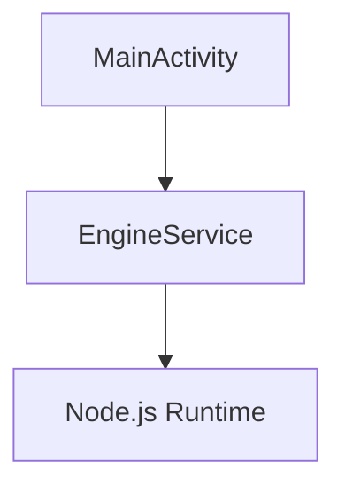

# Contributing to Anchor Android

**Thank you for your interest in contributing!**

Anchor Android is a sovereign memory server that brings the Anchor Engine to mobile devices. We welcome contributions of all kinds: code, documentation, testing, and ideas.

---

## 📜 Code of Conduct

### Our Pledge

We are committed to providing a welcoming and inspiring community for all. Please be respectful and constructive in your interactions.

### Our Standards

**Do:**
- Be welcoming and inclusive
- Respect different viewpoints
- Accept constructive criticism
- Focus on what's best for the community

**Don't:**
- Harass or discriminate
- Troll or insult
- Promote harmful behavior
- Disrupt the community

---

## 🚀 Getting Started

### 1. Set Up Development Environment

**Prerequisites:**
- **Linux or WSL2** (required for building the ARM64 engine binary)
- **Flutter SDK** (stable channel — `flutter channel stable && flutter upgrade`)
- **Android SDK** (API 34) and `adb`
- **Node.js ≥ 18** and **pnpm** (for engine binary compilation)
- **Git**

**Clone and Setup:**
```bash
git clone https://github.com/RSBalchII/Anchor-Android.git
cd Anchor-Android
```

**Build the Engine Binary:**
```bash
# Must run on Linux/WSL2
./sync_engine.sh
# Output: flutter_app/assets/engine/anchor-engine (~50MB ARM64 binary)
```

**Build the Flutter APK:**
```bash
cd flutter_app
flutter pub get
flutter build apk --debug
```

**Install on emulator/device:**
```bash
adb install build/app/outputs/flutter-apk/app-debug.apk
```

### 2. Development Without Building the Engine

If you only need to work on the Flutter UI or documentation, you can skip the engine
binary build and install a previous APK from the [GitHub Actions artifacts](https://github.com/RSBalchII/Anchor-Android/actions/workflows/build.yml).

**Good First Issues:**
- Documentation improvements
- Bug fixes in `flutter_app/lib/main.dart`
- Flutter unit tests for `EngineBootstrap`
- Improving error messages in the loading/error screens

**Find Issues:**
- Check `specs/tasks.md` for planned work
- Look for issues labeled "good first issue" on GitHub
- Create your own issue for improvements

---

## 📝 Development Workflow

### 1. Create a Branch

```bash
# From main branch
git checkout -b feature/your-feature-name

# Naming conventions:
# - feature/add-github-sync
# - bugfix/fix-engine-crash
# - docs/update-architecture
# - test/add-unit-tests
```

### 2. Make Changes

**Code Style:**
- Follow Dart/Flutter conventions (`flutter analyze` must pass)
- Use meaningful variable names
- Add comments for complex logic
- Keep functions small and focused
- For `sync_engine.sh` changes, use `shellcheck` for linting

**Documentation:**
- Update docs alongside code
- Use present tense
- Include code examples
- Add Mermaid diagrams for architecture

### 3. Test Your Changes

**Unit Tests:**
```bash
./gradlew testDebugUnitTest
```

**Integration Tests:**
```bash
./gradlew connectedAndroidTest
```

**Manual Testing:**
- Build and run on emulator
- Test on physical device (if possible)
- Verify no regressions

### 4. Commit Your Changes

**Commit Message Format:**
```
<type>: <description>

[optional body]

[optional footer]
```

**Types:**
- `feat:` New feature
- `fix:` Bug fix
- `docs:` Documentation update
- `test:` Test addition
- `refactor:` Code refactor
- `chore:` Build/config change

**Example:**
```
feat: add GitHub tarball ingestion

- Implement GitHub API client
- Add tarball unpacking logic
- Integrate with engine watchdog

Closes #42
```

### 5. Push and Create Pull Request

```bash
# Push to GitHub
git push origin feature/your-feature-name

# Create Pull Request:
# 1. Go to repository on GitHub
# 2. Click "Pull Requests"
# 3. Click "New Pull Request"
# 4. Select your branch
# 5. Fill out PR template
# 6. Submit
```

---

## 📚 Documentation Guidelines

### Writing Style

**Be Concise:**
```markdown
❌ Don't: "The EngineService is a very important component that is responsible for..."
✅ Do: "EngineService runs the Anchor Engine in the background."
```

**Use Present Tense:**
```markdown
❌ Don't: "The service will start when the app launches"
✅ Do: "The service starts when the app launches"
```

**Include Examples:**
```kotlin
// Good: Shows actual usage
EngineService.start(context)

// Better: Includes context
// Start engine in foreground
EngineService.start(this)  // Requires notification permission
```

### Code Blocks

**Always Specify Language:**
````markdown
```kotlin
class MainActivity : AppCompatActivity() {
    override fun onCreate(savedInstanceState: Bundle?) {
        super.onCreate()
        EngineService.start(this)
    }
}
```
````

**Keep Examples Runnable:**
- Include necessary imports
- Use realistic variable names
- Show expected output

### Diagrams

**Use Mermaid.js for Architecture:**
````markdown

````

**When to Diagram:**
- Component relationships
- Data flow
- State machines
- Sequence of operations

---

## 🧪 Testing Requirements

### Unit Tests

**Required For:**
- `EngineBootstrap` lifecycle logic (boot sequence, health polling)
- Binary extraction and freshness check
- Permission request helpers
- Network utilities

**Example Test:**
```dart
testWidgets('EngineBootstrap shows loading screen during boot', (tester) async {
  await tester.pumpWidget(const MaterialApp(home: EngineBootstrap()));
  expect(find.byType(CircularProgressIndicator), findsOneWidget);
});
```

### Integration Tests

**Required For:**
- Full engine boot sequence (binary extraction + start + health poll)
- WebView loads `localhost:3160` after engine ready
- Log file written to Downloads
- Engine process killed on widget disposal

**Example Test:**
```dart
testWidgets('Engine responds to health check', (tester) async {
  await tester.pumpWidget(const MaterialApp(home: EngineBootstrap()));
  // Wait for engine to be ready (≤ 90s)
  await tester.pumpAndSettle(const Duration(seconds: 90));
  expect(find.byType(WebViewWidget), findsOneWidget);
});
```

### Run Tests

```bash
cd flutter_app

# Unit tests
flutter test

# Integration tests (requires connected device/emulator)
flutter test integration_test/
```

### Manual Testing Checklist

**Before Submitting PR:**
- [ ] `flutter analyze` passes with no errors
- [ ] App builds without errors (`flutter build apk --debug`)
- [ ] App launches without crashes on emulator
- [ ] Engine starts and WebView loads `localhost:3160`
- [ ] `anchor_engine_verbose.log` appears in Downloads (if permissions granted)
- [ ] No new warnings in `adb logcat`
- [ ] Tests pass (`flutter test`)
- [ ] Documentation updated

---

## 🐛 Reporting Bugs

### Bug Report Template

```markdown
**Describe the bug**
A clear and concise description of what the bug is.

**To Reproduce**
Steps to reproduce the behavior:
1. Go to '...'
2. Click on '...'
3. Scroll down to '...'
4. See error

**Expected behavior**
A clear and concise description of what you expected to happen.

**Screenshots**
If applicable, add screenshots to help explain your problem.

**Environment:**
- Device: [e.g., Pixel 6]
- Android Version: [e.g., 14]
- App Version: [e.g., 0.1.0]

**Logs**
```
Paste relevant Logcat output here
```

**Additional context**
Add any other context about the problem here.
```

### Where to Report

- **GitHub Issues:** https://github.com/your-org/anchor-android/issues
- **Discord:** (link to community Discord)
- **Email:** security@anchoros.org (for security issues)

---

## 💡 Feature Proposals

### Feature Request Template

```markdown
**Is your feature request related to a problem?**
A clear and concise description of what the problem is.

**Describe the solution you'd like**
A clear and concise description of what you want to happen.

**Describe alternatives you've considered**
A clear and concise description of any alternative solutions or features you've considered.

**Implementation ideas**
If you have ideas about how to implement this feature, share them here.

**Additional context**
Add any other context, mockups, or screenshots about the feature request.
```

### Feature Acceptance Criteria

**We Accept Features That:**
- Align with project vision (sovereign, local-first)
- Don't compromise security
- Have test coverage
- Include documentation
- Follow code style guidelines

**We Don't Accept:**
- Features requiring cloud services
- Features that compromise user privacy
- Features without tests
- Features that add unnecessary complexity

---

## 🔒 Security

### Reporting Security Issues

**Do Not:**
- Report security issues in public issues
- Discuss vulnerabilities in public channels

**Do:**
- Email security@anchoros.org
- Use encrypted communication (PGP key on website)
- Give us time to fix before disclosing

### Security Best Practices

**When Contributing:**
- Don't commit secrets (API keys, passwords)
- Don't weaken encryption
- Don't remove security checks
- Do follow principle of least privilege

---

## 📖 Learning Resources

### Flutter & Dart Development
- **Flutter Getting Started:** https://docs.flutter.dev/get-started
- **Dart Language Tour:** https://dart.dev/language
- **Flutter cookbook:** https://docs.flutter.dev/cookbook
- **webview_flutter plugin:** https://pub.dev/packages/webview_flutter

### Android Development
- **Android Basics:** https://developer.android.com/get-started
- **Android Foreground Services:** https://developer.android.com/guide/components/foreground-services

### Node.js on Android (ARM64 binary approach)
- **anchor-engine-node** (the engine being bundled): https://github.com/RSBalchII/anchor-engine-node
- **@yao-pkg/pkg** (Node.js binary compiler): https://github.com/yao-pkg/pkg

### Tailscale
- **Getting Started:** https://tailscale.com/kb/1017/install/
- **Android Setup:** https://tailscale.com/kb/1065/android/

---

## 🎯 Areas Needing Contribution

### High Priority
- **PR #13 Review**: Merge the `chmod +x` fix
- **GitHub Sync**: Implement tarball fetch + unpack (v0.3.0)
- **Tailscale SDK**: Integrate official Tailscale Android library
- **Tests**: Write Flutter unit/integration tests for `EngineBootstrap`

### Medium Priority
- **Settings Screen**: GitHub token entry, sync interval, port (v0.3.0)
- **Native UI**: Replace Flutter WebView shell with Jetpack Compose (v0.4.0)
- **Documentation**: Improve guides and code examples
- **Performance**: Optimize binary boot time, battery usage

### Low Priority (But Welcome)
- **Icon Design**: Create app icons
- **Translations**: Localize to other languages
- **Website**: Build landing page

---

## 🏆 Recognition

**Contributors Are Recognized By:**
- Listing in README.md contributors section
- Mention in release notes
- Contributor badge on GitHub
- Invitation to project Discord

**Significant Contributions:**
- Co-authorship on papers
- Speaking opportunities
- Conference travel support (if applicable)

---

## ❓ Questions?

**Get Help:**
- **GitHub Discussions:** https://github.com/your-org/anchor-android/discussions
- **Discord:** (link to community Discord)
- **Email:** hello@anchoros.org

**Common Questions:**

**Q: Do I need Android development experience?**  
A: Basic Android knowledge helps, but motivated beginners are welcome! Start with small documentation fixes.

**Q: Can I contribute without coding?**  
A: Absolutely! Documentation, testing, design, and community help are all valuable.

**Q: How long does PR review take?**  
A: We aim to review within 48 hours. Complex features may take longer.

**Q: Can I work on multiple issues?**  
A: Yes! Just let us know which issues you're working on.

---

## 📜 License

By contributing to Anchor Android, you agree that your contributions will be licensed under the AGPL-3.0 license.

---

**Thank you for contributing to Anchor Android! 🚀**

Together, we're building sovereign memory infrastructure for everyone.
