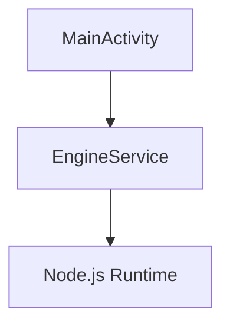

# Contributing to Anchor Android

**Thank you for your interest in contributing!**

Anchor Android is a sovereign memory server that brings the Anchor Engine to mobile devices. We welcome contributions of all kinds: code, documentation, testing, and ideas.

---

## 📜 Code of Conduct

### Our Pledge

We are committed to providing a welcoming and inspiring community for all. Please be respectful and constructive in your interactions.

### Our Standards

**Do:**
- Be welcoming and inclusive
- Respect different viewpoints
- Accept constructive criticism
- Focus on what's best for the community

**Don't:**
- Harass or discriminate
- Troll or insult
- Promote harmful behavior
- Disrupt the community

---

## 🚀 Getting Started

### 1. Set Up Development Environment

**Prerequisites:**
- Android Studio (Arctic Fox or newer)
- Android SDK 34
- Git

**Clone and Setup:**
```bash
git clone https://github.com/your-org/anchor-android.git
cd anchor-android
```

**Open in Android Studio:**
```
File → Open → Select anchor-android directory
Wait for Gradle sync
```

### 2. Build the Project

```bash
# Build debug APK
./gradlew assembleDebug

# Install on emulator
adb install app/build/outputs/apk/debug/app-debug.apk

# Run tests
./gradlew test
```

### 3. Make Your First Contribution

**Good First Issues:**
- Documentation improvements
- Bug fixes
- Test coverage
- UI polish

**Find Issues:**
- Check `specs/tasks.md` for planned work
- Look for issues labeled "good first issue" on GitHub
- Create your own issue for improvements

---

## 📝 Development Workflow

### 1. Create a Branch

```bash
# From main branch
git checkout -b feature/your-feature-name

# Naming conventions:
# - feature/add-github-sync
# - bugfix/fix-engine-crash
# - docs/update-architecture
# - test/add-unit-tests
```

### 2. Make Changes

**Code Style:**
- Follow Kotlin conventions
- Use meaningful variable names
- Add comments for complex logic
- Keep functions small and focused

**Documentation:**
- Update docs alongside code
- Use present tense
- Include code examples
- Add Mermaid diagrams for architecture

### 3. Test Your Changes

**Unit Tests:**
```bash
./gradlew testDebugUnitTest
```

**Integration Tests:**
```bash
./gradlew connectedAndroidTest
```

**Manual Testing:**
- Build and run on emulator
- Test on physical device (if possible)
- Verify no regressions

### 4. Commit Your Changes

**Commit Message Format:**
```
<type>: <description>

[optional body]

[optional footer]
```

**Types:**
- `feat:` New feature
- `fix:` Bug fix
- `docs:` Documentation update
- `test:` Test addition
- `refactor:` Code refactor
- `chore:` Build/config change

**Example:**
```
feat: add GitHub tarball ingestion

- Implement GitHub API client
- Add tarball unpacking logic
- Integrate with engine watchdog

Closes #42
```

### 5. Push and Create Pull Request

```bash
# Push to GitHub
git push origin feature/your-feature-name

# Create Pull Request:
# 1. Go to repository on GitHub
# 2. Click "Pull Requests"
# 3. Click "New Pull Request"
# 4. Select your branch
# 5. Fill out PR template
# 6. Submit
```

---

## 📚 Documentation Guidelines

### Writing Style

**Be Concise:**
```markdown
❌ Don't: "The EngineService is a very important component that is responsible for..."
✅ Do: "EngineService runs the Anchor Engine in the background."
```

**Use Present Tense:**
```markdown
❌ Don't: "The service will start when the app launches"
✅ Do: "The service starts when the app launches"
```

**Include Examples:**
```kotlin
// Good: Shows actual usage
EngineService.start(context)

// Better: Includes context
// Start engine in foreground
EngineService.start(this)  // Requires notification permission
```

### Code Blocks

**Always Specify Language:**
````markdown
```kotlin
class MainActivity : AppCompatActivity() {
    override fun onCreate(savedInstanceState: Bundle?) {
        super.onCreate()
        EngineService.start(this)
    }
}
```
````

**Keep Examples Runnable:**
- Include necessary imports
- Use realistic variable names
- Show expected output

### Diagrams

**Use Mermaid.js for Architecture:**
````markdown

````

**When to Diagram:**
- Component relationships
- Data flow
- State machines
- Sequence of operations

---

## 🧪 Testing Requirements

### Unit Tests

**Required For:**
- Service lifecycle logic
- Storage management
- Network utilities
- Data transformations

**Example Test:**
```kotlin
@Test
fun `engine service creates notification channel`() {
    val service = EngineService()
    service.onCreate()
    
    // Verify notification channel created
    val notificationManager = getSystemService(NotificationManager::class.java)
    val channel = notificationManager.getNotificationChannel(CHANNEL_ID)
    assertNotNull(channel)
}
```

### Integration Tests

**Required For:**
- Engine startup flow
- GitHub sync workflow
- Tailscale connectivity
- API endpoints

**Example Test:**
```kotlin
@Test
fun `engine responds to health check`() {
    // Start engine
    EngineService.start(context)
    waitForEngineReady()
    
    // Query health endpoint
    val response = httpClient.get("http://localhost:3160/health")
    
    // Verify response
    assertEquals(200, response.status)
    assertEquals("healthy", response.json().status)
}
```

### Manual Testing Checklist

**Before Submitting PR:**
- [ ] App builds without errors
- [ ] App launches without crashes
- [ ] Engine service starts
- [ ] No new warnings in Logcat
- [ ] Tests pass locally
- [ ] Documentation updated

---

## 🐛 Reporting Bugs

### Bug Report Template

```markdown
**Describe the bug**
A clear and concise description of what the bug is.

**To Reproduce**
Steps to reproduce the behavior:
1. Go to '...'
2. Click on '...'
3. Scroll down to '...'
4. See error

**Expected behavior**
A clear and concise description of what you expected to happen.

**Screenshots**
If applicable, add screenshots to help explain your problem.

**Environment:**
- Device: [e.g., Pixel 6]
- Android Version: [e.g., 14]
- App Version: [e.g., 0.1.0]

**Logs**
```
Paste relevant Logcat output here
```

**Additional context**
Add any other context about the problem here.
```

### Where to Report

- **GitHub Issues:** https://github.com/your-org/anchor-android/issues
- **Discord:** (link to community Discord)
- **Email:** security@anchoros.org (for security issues)

---

## 💡 Feature Proposals

### Feature Request Template

```markdown
**Is your feature request related to a problem?**
A clear and concise description of what the problem is.

**Describe the solution you'd like**
A clear and concise description of what you want to happen.

**Describe alternatives you've considered**
A clear and concise description of any alternative solutions or features you've considered.

**Implementation ideas**
If you have ideas about how to implement this feature, share them here.

**Additional context**
Add any other context, mockups, or screenshots about the feature request.
```

### Feature Acceptance Criteria

**We Accept Features That:**
- Align with project vision (sovereign, local-first)
- Don't compromise security
- Have test coverage
- Include documentation
- Follow code style guidelines

**We Don't Accept:**
- Features requiring cloud services
- Features that compromise user privacy
- Features without tests
- Features that add unnecessary complexity

---

## 🔒 Security

### Reporting Security Issues

**Do Not:**
- Report security issues in public issues
- Discuss vulnerabilities in public channels

**Do:**
- Email security@anchoros.org
- Use encrypted communication (PGP key on website)
- Give us time to fix before disclosing

### Security Best Practices

**When Contributing:**
- Don't commit secrets (API keys, passwords)
- Don't weaken encryption
- Don't remove security checks
- Do follow principle of least privilege

---

## 📖 Learning Resources

### Android Development
- **Android Basics in Kotlin:** https://developer.android.com/courses/android-basics-kotlin/overview
- **Kotlin Bootcamp:** https://developer.android.com/courses/kotlin-bootcamp/overview
- **Android Architecture:** https://developer.android.com/topic/architecture

### Node.js on Android
- **nodejs-mobile:** https://github.com/nicollite/nodejs-mobile
- **Examples:** https://github.com/nicollite/nodejs-mobile-examples

### Tailscale
- **Getting Started:** https://tailscale.com/kb/1017/install/
- **Android Setup:** https://tailscale.com/kb/1065/android/

---

## 🎯 Areas Needing Contribution

### High Priority
- **Node.js Integration:** Help bundle nodejs-mobile properly
- **GitHub Sync:** Implement robust tarball fetching/unpacking
- **Tailscale SDK:** Integrate official Tailscale Android library
- **UI/UX:** Design native Android interface (Jetpack Compose)

### Medium Priority
- **Unit Tests:** Increase test coverage
- **Documentation:** Improve guides and examples
- **Performance:** Optimize battery and memory usage
- **Accessibility:** Make app usable for everyone

### Low Priority (But Welcome)
- **Icon Design:** Create app icons
- **Translations:** Localize to other languages
- **Website:** Build landing page
- **Marketing:** Spread the word

---

## 🏆 Recognition

**Contributors Are Recognized By:**
- Listing in README.md contributors section
- Mention in release notes
- Contributor badge on GitHub
- Invitation to project Discord

**Significant Contributions:**
- Co-authorship on papers
- Speaking opportunities
- Conference travel support (if applicable)

---

## ❓ Questions?

**Get Help:**
- **GitHub Discussions:** https://github.com/your-org/anchor-android/discussions
- **Discord:** (link to community Discord)
- **Email:** hello@anchoros.org

**Common Questions:**

**Q: Do I need Android development experience?**  
A: Basic Android knowledge helps, but motivated beginners are welcome! Start with small documentation fixes.

**Q: Can I contribute without coding?**  
A: Absolutely! Documentation, testing, design, and community help are all valuable.

**Q: How long does PR review take?**  
A: We aim to review within 48 hours. Complex features may take longer.

**Q: Can I work on multiple issues?**  
A: Yes! Just let us know which issues you're working on.

---

## 📜 License

By contributing to Anchor Android, you agree that your contributions will be licensed under the AGPL-3.0 license.

---

**Thank you for contributing to Anchor Android! 🚀**

Together, we're building sovereign memory infrastructure for everyone.
