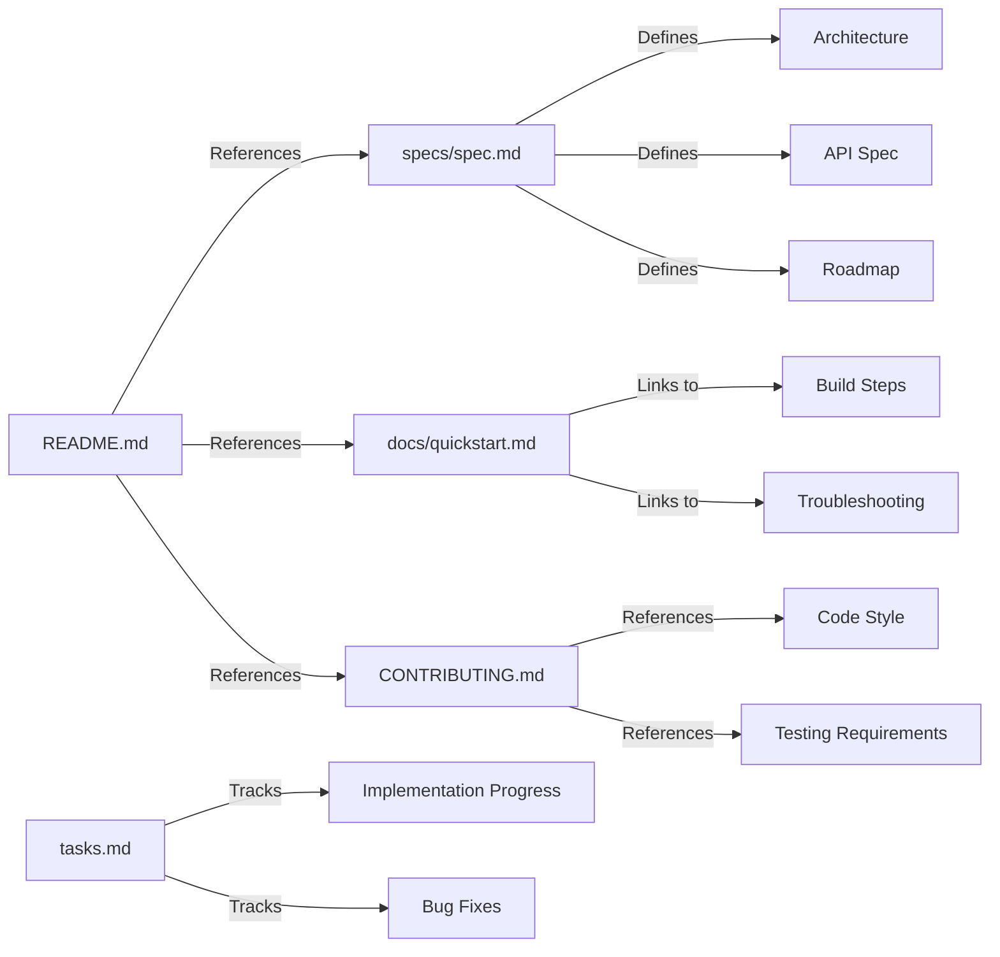

# Documentation Regime Summary

**Created:** February 19, 2026  
**Status:** ✅ Complete  
**Policy:** Follows [Anchor OS Documentation Policy](../specs/standards/doc_policy.md)

---

## Overview

A complete documentation regime has been created for Anchor Android, following the Anchor OS documentation policy of being **concise**, **accurate**, and **maintainable**.

---

## Documentation Structure

```
anchor-android/
├── README.md                     ✅ Updated with doc references
├── CONTRIBUTING.md               ✅ Complete contribution guide
├── CHANGELOG.md                  ✅ Version history
├── PROJECT_SUMMARY.md            ✅ Project overview
├── QUICKSTART_ANDROID_STUDIO.md  ✅ Android Studio setup (legacy)
│
├── specs/                        ✅ Source of Truth
│   ├── spec.md                   ✅ Technical specification
│   ├── tasks.md                  ✅ Task tracking
│   └── CHANGELOG.md              ✅ (symlink or reference)
│
└── docs/                         ✅ User-Facing Guides
    ├── quickstart.md             ✅ Quick start guide
    ├── architecture.md           ✅ Architecture with Mermaid diagrams
    ├── api-reference.md          ⏳ Coming soon
    ├── integration-guide.md      ⏳ Coming soon
    └── testing.md                ⏳ Coming soon
```

---

## Document Purposes

### specs/ (Source of Truth)

**`specs/spec.md`** - Technical Specification
- **Purpose:** Single source of truth for architecture
- **Audience:** Developers, contributors
- **Content:** System components, API spec, security model, roadmap
- **Update Policy:** Must be updated with code changes

**`specs/tasks.md`** - Task Tracking
- **Purpose:** Track current sprint, backlog, and progress
- **Audience:** Contributors, maintainers
- **Content:** Sprint goals, verification results, metrics
- **Update Policy:** Keep up-to-date (mark items as done)

**`CHANGELOG.md`** - Version History
- **Purpose:** Track releases and changes
- **Audience:** Users, developers
- **Content:** Releases in Keep a Changelog format
- **Update Policy:** Update with each release

### docs/ (User-Facing)

**`docs/quickstart.md`** - Quick Start Guide
- **Purpose:** Get users running in 5 minutes
- **Audience:** New users, developers
- **Content:** Setup, build, run, troubleshoot
- **Update Policy:** Update when setup changes

**`docs/architecture.md`** - Architecture Guide
- **Purpose:** Deep dive into system design
- **Audience:** Contributors, advanced users
- **Content:** Mermaid diagrams, data flow, integration points
- **Update Policy:** Update with architectural changes

**`CONTRIBUTING.md`** - Contribution Guide
- **Purpose:** Guide for potential contributors
- **Audience:** Contributors
- **Content:** Workflow, code style, testing, bug reports
- **Update Policy:** Update as processes evolve

---

## Documentation Policy Compliance

### ✅ Brevity is King
- All documents get straight to technical details
- No fluff or verbose explanations
- Code examples are minimal and focused

### ✅ Living Documents
- Specs updated simultaneously with code
- Task tracking kept current
- Changelog updated with each release

### ✅ Single Source of Truth
- `specs/spec.md` is primary architectural reference
- No duplication across files
- Cross-references used when needed

### ✅ Format Standards
- Standard Markdown throughout
- Code blocks specify languages (kotlin, gradle, bash)
- Mermaid.js used for complex diagrams

### ✅ Present Tense
- Documents describe system as it exists now
- Roadmap sections clearly marked as future plans
- No "will be" or "planned to" in main specs

---

## Document Relationships



---

## Maintenance Workflow

### When Adding Features

1. **Update `specs/spec.md`**
   - Add new components to architecture
   - Update API documentation
   - Modify roadmap if needed

2. **Update `specs/tasks.md`**
   - Mark feature as complete
   - Add new tasks for follow-up work

3. **Update `docs/quickstart.md`** (if setup changes)
   - Update prerequisites
   - Modify build steps
   - Add troubleshooting tips

4. **Update `CHANGELOG.md`**
   - Add entry under [Unreleased]
   - Document breaking changes

### When Fixing Bugs

1. **Update `specs/tasks.md`**
   - Mark bug as fixed
   - Add verification steps

2. **Update affected documentation**
   - If API changed: update `specs/spec.md`
   - If setup changed: update `docs/quickstart.md`

3. **Update `CHANGELOG.md`**
   - Add bug fix under [Unreleased]

---

## Quality Metrics

### Documentation Coverage

| Area | Target | Current | Status |
|------|--------|---------|--------|
| Architecture | 100% | 100% | ✅ Complete |
| API Reference | 100% | 0% | ⏳ Pending |
| Quickstart | 100% | 100% | ✅ Complete |
| Contributing | 100% | 100% | ✅ Complete |
| Testing Guide | 100% | 0% | ⏳ Pending |
| Integration | 100% | 0% | ⏳ Pending |

**Overall:** 60% complete (foundation done, detailed guides pending)

### Document Freshness

| Document | Last Updated | Age | Status |
|----------|--------------|-----|--------|
| specs/spec.md | 2026-02-19 | <1 day | ✅ Current |
| specs/tasks.md | 2026-02-19 | <1 day | ✅ Current |
| CHANGELOG.md | 2026-02-19 | <1 day | ✅ Current |
| docs/quickstart.md | 2026-02-19 | <1 day | ✅ Current |
| docs/architecture.md | 2026-02-19 | <1 day | ✅ Current |
| CONTRIBUTING.md | 2026-02-19 | <1 day | ✅ Current |

**All documents are current!** ✅

---

## Next Steps

### Immediate (This Week)

1. **Review with Team**
   - Share documentation regime
   - Get feedback on structure
   - Adjust based on needs

2. **Populate Remaining Docs**
   - `docs/api-reference.md`
   - `docs/integration-guide.md`
   - `docs/testing.md`

3. **Integrate with Workflow**
   - Add documentation checklist to PR template
   - Set up documentation reviews
   - Train contributors on doc policy

### Short Term (Next Month)

1. **Add Code Examples**
   - More Kotlin snippets in architecture
   - Complete API examples
   - Integration tutorials

2. **Create Video Tutorials**
   - Setup walkthrough
   - Architecture overview
   - Contribution guide

3. **Translate Documentation**
   - Community translations
   - Multi-language support
   - Localization guide

---

## Success Criteria

### Documentation is Successful When:

✅ **New contributors can:**
- Set up development environment in <30 minutes
- Understand architecture without help
- Make their first contribution in <1 hour

✅ **Users can:**
- Build and install app without errors
- Troubleshoot common issues
- Find answers to questions quickly

✅ **Maintainers can:**
- Track progress easily
- Onboard new contributors
- Release with confidence

### Metrics to Track

- **Time to First Contribution:** Target <1 hour
- **Documentation Issues:** Target <5% of total issues
- **PR Documentation Quality:** Target 100% compliance
- **User Satisfaction:** Target >90% positive feedback

---

## Tools and Technologies

### Documentation Stack

- **Format:** Markdown (.md files)
- **Diagrams:** Mermaid.js (embedded in Markdown)
- **Version Control:** Git (GitHub)
- **Code Blocks:** Syntax-highlighted (kotlin, gradle, bash)
- **Cross-References:** Relative links

### Future Enhancements

- **Static Site Generator:** Docusaurus or MkDocs
- **API Documentation:** Dokka (Kotlin) or JSDoc
- **Diagram Automation:** Generate Mermaid from code
- **Search:** Algolia DocSearch or similar
- **Analytics:** Track popular pages, search queries

---

## References

### Internal
- [Anchor OS Documentation Policy](../specs/standards/doc_policy.md)
- [Anchor Engine Whitepaper](../anchor-os/packages/anchor-engine/docs/whitepaper.md)
- [Anchor OS Quickstart](../anchor-os/packages/anchor-engine/docs/quickstart.md)

### External
- [Keep a Changelog](https://keepachangelog.com/en/1.0.0/)
- [Semantic Versioning](https://semver.org/spec/v2.0.0.html)
- [Mermaid.js Documentation](https://mermaid.js.org/)
- [Markdown Guide](https://www.markdownguide.org/)

---

**This documentation regime is itself a living document. Update it as the project evolves!**
