# Anchor Android - Architecture

**Version:** 0.1.0  
**Last Updated:** February 19, 2026  
**Audience:** Developers, Contributors

---

## 1. System Overview

Anchor Android implements a **sovereign memory server** architecture where your Android device runs the Anchor Engine and serves knowledge to AI coding tools over an encrypted Tailscale network.

### High-Level Architecture

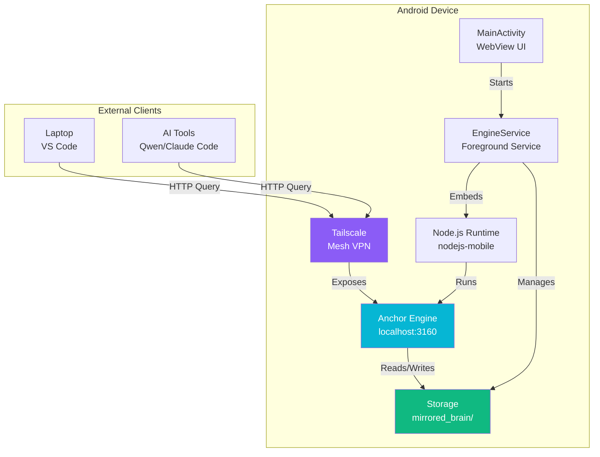

**Key Components:**
1. **MainActivity** - UI layer (WebView wrapper)
2. **EngineService** - Background service managing Node.js runtime
3. **Node.js Runtime** - nodejs-mobile embedding V8 engine
4. **Anchor Engine** - Knowledge base server (Express + PGlite)
5. **Storage** - `mirrored_brain/` directory with code and database
6. **Tailscale** - Encrypted mesh VPN for secure access

---

## 2. Component Architecture

### 2.1 Application Layers

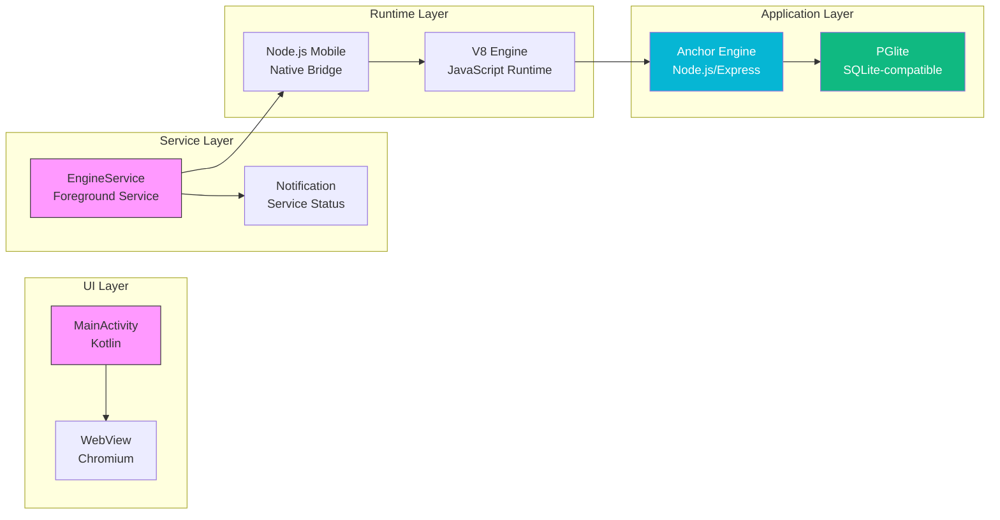

**Layer Responsibilities:**
- **UI Layer:** User interaction, WebView display
- **Service Layer:** Background execution, lifecycle management
- **Runtime Layer:** JavaScript execution, native bridge
- **Application Layer:** Knowledge base logic, database

---

### 2.2 Service Lifecycle

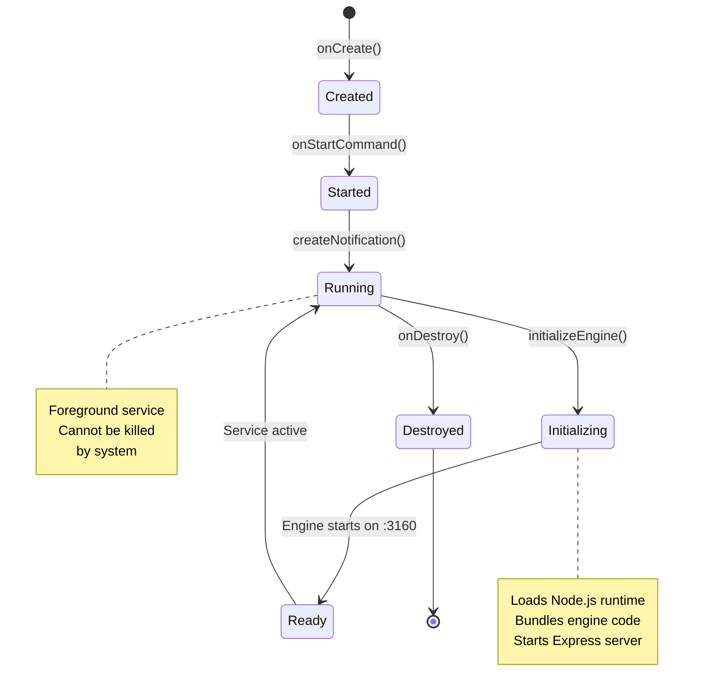

**Lifecycle Notes:**
- Service starts as **foreground** (requires notification)
- **START_STICKY** ensures restart if killed
- Initialization is **asynchronous** (non-blocking)
- Cleanup happens in `onDestroy()`

---

### 2.3 Storage Architecture

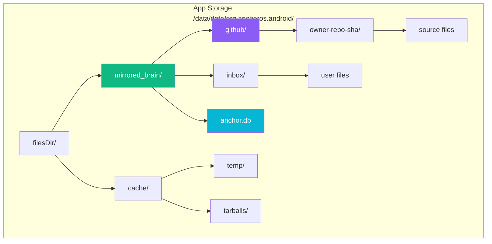

**Storage Structure:**
```
mirrored_brain/
├── github/
│   └── {owner}-{repo}-{commit_sha}/
│       ├── src/
│       ├── Cargo.toml
│       └── ...
├── inbox/
│   └── user_uploaded_files/
└── anchor.db  (PGlite database)
```

**Access Patterns:**
- **Read:** Engine queries database, reads source files via byte offsets
- **Write:** GitHub sync downloads tarballs, watchdog ingests files
- **Cleanup:** User-initiated (delete repos from settings)

---

## 3. Data Flow

### 3.1 Query Flow (AI Tool → Engine)

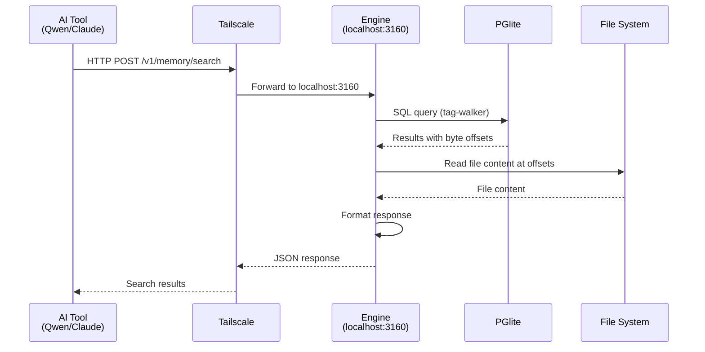

**Performance:**
- Query latency: ~50-100ms (local)
- Network latency: +10-50ms (via Tailscale)
- Total: ~60-150ms typical

---

### 3.2 Ingestion Flow (GitHub → Storage)

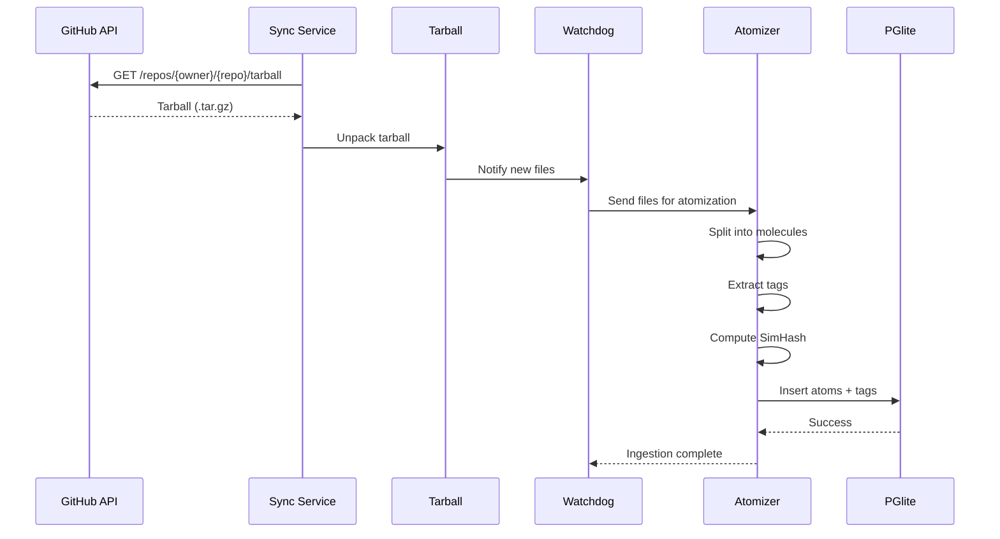

**Ingestion Performance:**
- Small repo (<10MB): ~5-10 seconds
- Medium repo (10-100MB): ~30-60 seconds
- Large repo (>100MB): ~2-5 minutes

---

## 4. Integration Points

### 4.1 Node.js Mobile Bridge

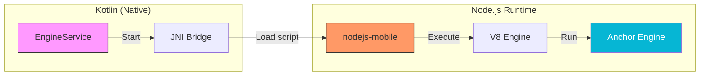

**Integration Code:**
```kotlin
// In EngineService.kt
private fun initializeEngine() {
    val nodeJS = NodeJS.getInstance(applicationContext)
    
    // Copy bundled engine from assets to app storage
    copyAssets("engine", filesDir.absolutePath)
    
    // Start Node.js with engine script
    nodeJS.start(
        script = "${filesDir.absolutePath}/engine/dist/index.js",
        args = arrayOf("--port", "3160")
    )
}
```

---

### 4.2 Tailscale Network Stack

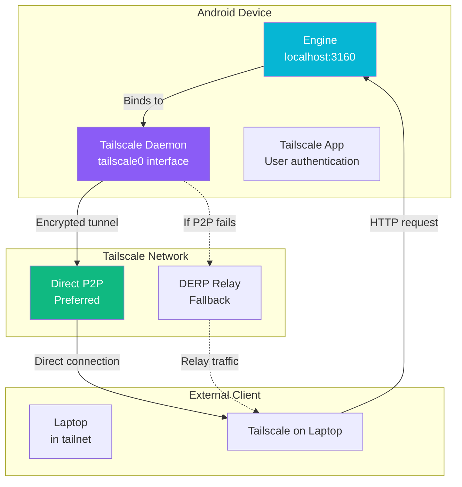

**Security Properties:**
- All traffic encrypted (WireGuard protocol)
- No open ports on device
- Authentication via Tailscale login
- Access control via tailnet ACLs

---

## 5. Resource Management

### 5.1 Memory Profile

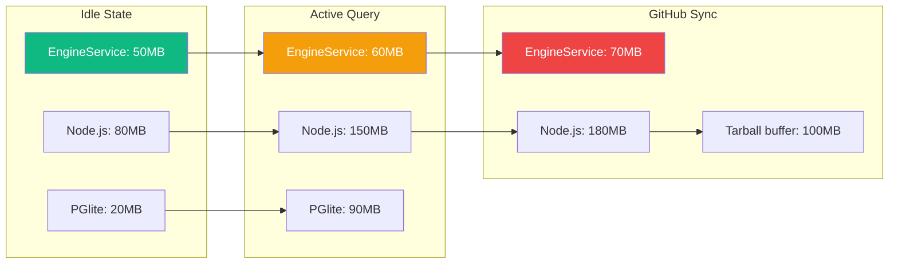

**Memory Targets:**
- **Idle:** <200MB total
- **Active:** <350MB total
- **Sync:** <400MB total
- **OOM threshold:** 512MB (Android may kill)

---

### 5.2 Battery Impact

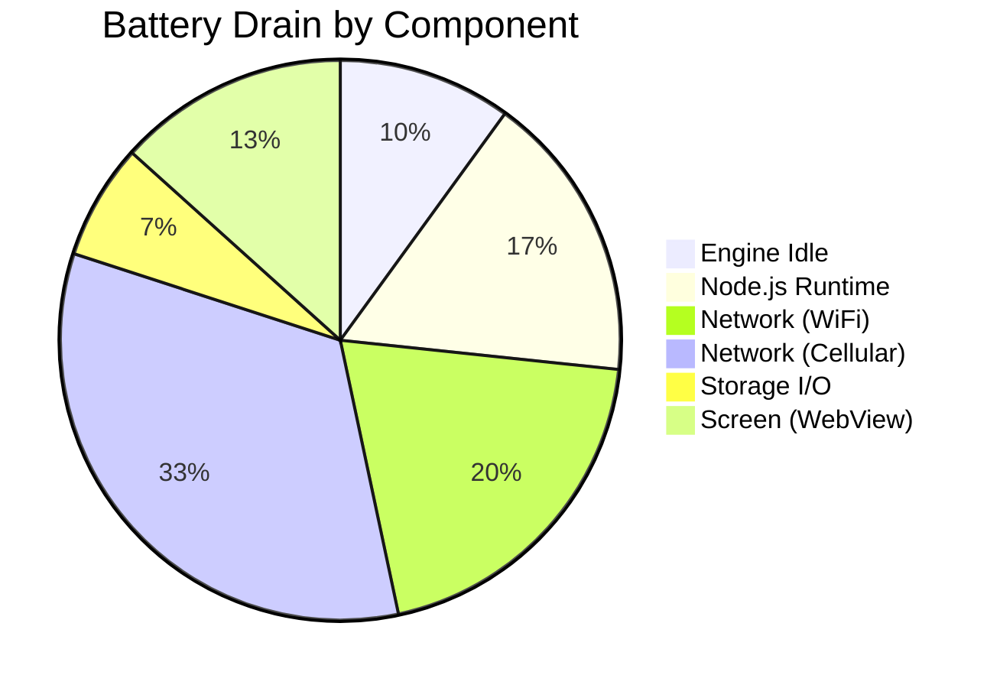

**Optimization Strategies:**
- Use WorkManager for background sync
- Sync only on WiFi + charging
- Sleep mode after 5 minutes idle
- Reduce polling frequency

---

## 6. Security Architecture

### 6.1 Threat Model

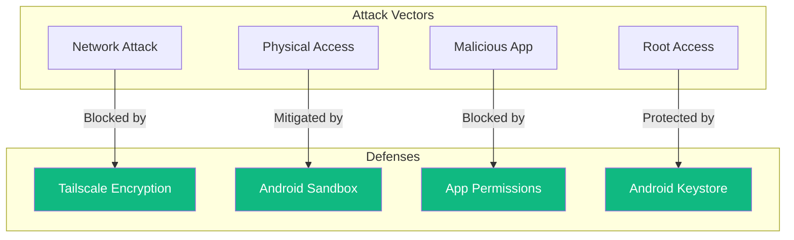

**Security Guarantees:**
1. **Data at rest:** Encrypted by Android filesystem encryption
2. **Data in transit:** Encrypted by Tailscale (WireGuard)
3. **Credentials:** Stored in Android Keystore (hardware-backed)
4. **Network:** No open ports, Tailscale-only access

---

## 7. Future Architecture

### 7.1 Planned Improvements (v0.3.0+)

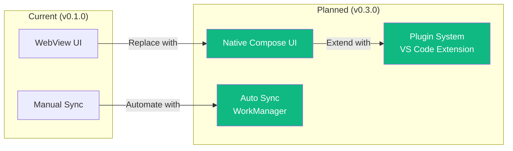

**Improvements:**
- Native UI (Jetpack Compose) for better performance
- Background sync with WorkManager (battery optimized)
- Plugin ecosystem for IDE integration
- Multi-user support (shared tailnets)

---

## 8. References

### 8.1 Related Documents
- **Technical Spec:** `specs/spec.md`
- **Quickstart:** `docs/quickstart.md`
- **API Reference:** `api-reference.md`
- **Integration Guide:** `integration-guide.md`

### 8.2 External Resources
- **nodejs-mobile:** https://github.com/nicollite/nodejs-mobile
- **Tailscale:** https://tailscale.com/kb/
- **Android Architecture:** https://developer.android.com/topic/architecture

---

*This architecture document is kept up-to-date with code changes. Last verified: February 19, 2026.*
